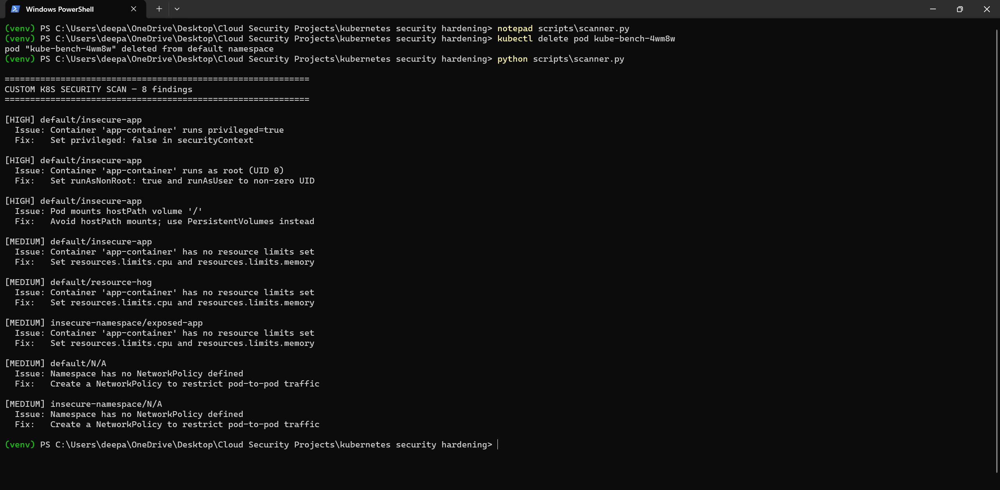
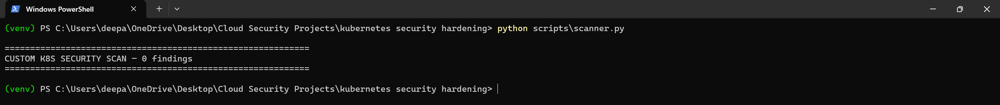

# Kubernetes Security Hardening Scanner

A custom Python-based security scanner for Kubernetes clusters, validated against the industry-standard **kube-bench** (CIS Kubernetes Benchmark) tool. Built and tested on a live local cluster (minikube), not just static YAML analysis.

## Why this exists

Kubernetes clusters ship insecure by default — misconfigured RBAC, privileged containers, missing NetworkPolicies. These are among the most common real-world attack vectors in cloud infrastructure (e.g. the 2020 Tesla cryptojacking incident via an exposed, unauthenticated Kubernetes dashboard).

`kube-bench` checks cluster-level config against the CIS Benchmark, but most of its Kubernetes Policies checks (RBAC, Pod Security, NetworkPolicies) are marked **Manual** — meaning it tells you to check something but doesn't actually inspect live workloads. This project fills that gap with a custom scanner that inspects the live cluster state directly.

## Architecture

```
┌─────────────────┐      ┌──────────────────┐      ┌────────────────┐
│  minikube        │      │  kube-bench      │      │  Custom Python │
│  local cluster   │─────▶│  (CIS Benchmark  │      │  scanner       │
│                  │      │  cluster config) │      │  (live pod/ns  │
│                  │      └──────────────────┘      │  inspection)   │
│                  │                                 └────────────────┘
│                  │──────────────────────────────────────▶│
└─────────────────┘                                        ▼
                                                    Combined findings report
```

## Tool choices and why

- **kube-bench** — official, widely-used implementation of the CIS Kubernetes Benchmark. Runs as a Job inside the cluster, checks control plane, etcd, and worker node config against ~100 checks.
- **Custom Python scanner (kubernetes client library)** — kube-bench's Kubernetes Policies section is almost entirely "Manual" checks with no automated verdict. This scanner directly queries the live cluster via the Kubernetes API to check:
  - Privileged containers and containers running as root (UID 0)
  - hostPath volume mounts
  - Missing resource limits (DoS risk — unbounded CPU/memory)
  - Namespaces with no NetworkPolicy defined (flat network, no pod isolation)
- Scoped to exclude `kube-system`, `kube-public`, `kube-node-lease` — these are cluster-internal namespaces managed by Kubernetes itself, not user workloads, and legitimately require hostPath mounts and elevated permissions to function.

## A real problem I hit

After fixing the intentionally root/privileged pod by setting `runAsUser: 1000`, the pod crashed:

```
nginx: [emerg] mkdir() "/var/cache/nginx/client_temp" failed (13: Permission denied)
```

The standard `nginx:latest` image assumes root by default — it writes to root-owned directories on startup. Forcing a non-root UID broke it. The fix wasn't a config workaround; it was switching to `nginxinc/nginx-unprivileged`, an image purpose-built to run as a non-root user without permission conflicts. This is the actual tradeoff behind Pod Security hardening — non-root enforcement requires non-root-compatible images, not just a securityContext flag.

## Project structure

```
kubernetes security hardening/
├── vulnerable-manifests/     # Intentionally vulnerable K8s manifests (target for scanning)
├── scripts/
│   └── scanner.py            # Custom Python scanner (Kubernetes API-based)
├── docs/
│   └── screenshots/          # Before/after scan evidence
└── README.md
```

## Vulnerability found and fixed

| # | Issue | Severity | Fix |
|---|-------|----------|-----|
| 1 | Container running `privileged: true` | HIGH | Set `privileged: false` |
| 2 | Container running as root (UID 0) | HIGH | Set `runAsUser: 1000`, `runAsNonRoot: true`, switched to `nginx-unprivileged` image |
| 3 | Pod mounting `hostPath: /` (full host filesystem) | HIGH | Removed hostPath volume entirely |
| 4-6 | Containers with no resource limits | MEDIUM | Set `resources.limits.cpu` / `.memory` on all 3 pods |
| 7-8 | Namespaces with no NetworkPolicy (flat network) | MEDIUM | Added default-deny-all NetworkPolicy to both namespaces |

**Before:** 8 findings across 3 pods, 2 namespaces
**After:** 0 findings




## kube-bench baseline

Ran against the same cluster: **56 PASS, 14 FAIL, 61 WARN**. Notably, every RBAC/Pod Security/NetworkPolicy check (Kubernetes Policies section) came back WARN — confirming the gap this custom scanner fills.

## Running locally

```bash
minikube start --driver=docker
kubectl apply -f vulnerable-manifests/
python -m venv venv
venv\Scripts\activate
pip install kubernetes
python scripts/scanner.py
```

## Status

✅ Complete — vulnerable manifests deployed, kube-bench baseline captured, custom scanner built and validated, all findings remediated, before/after evidence documented.
